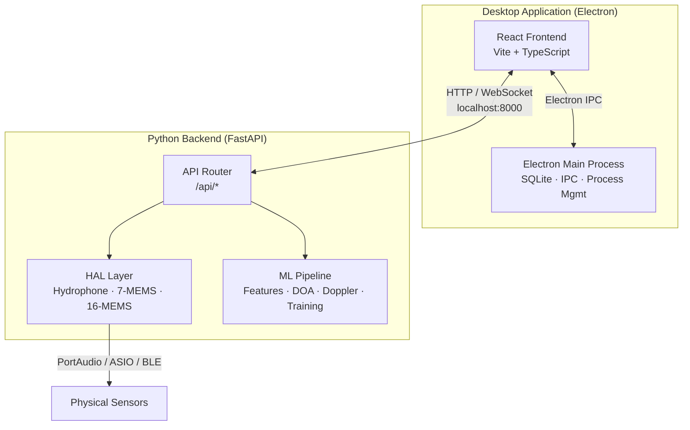
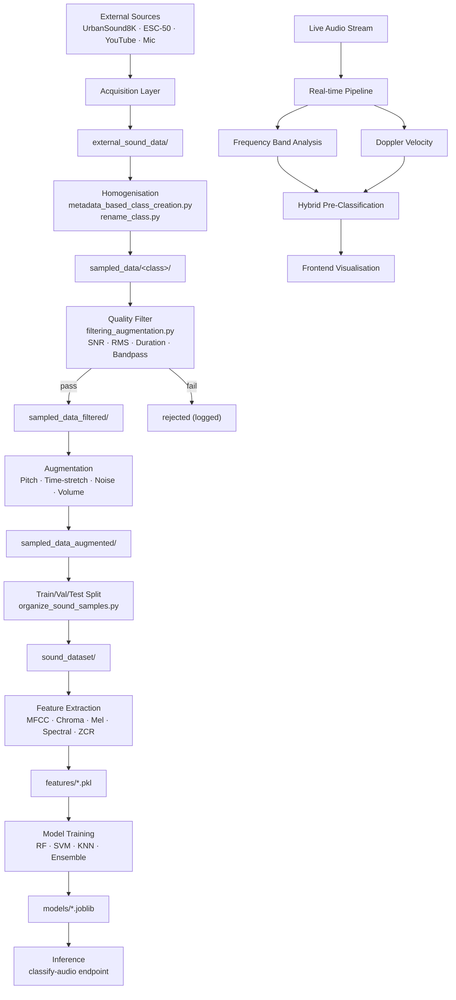
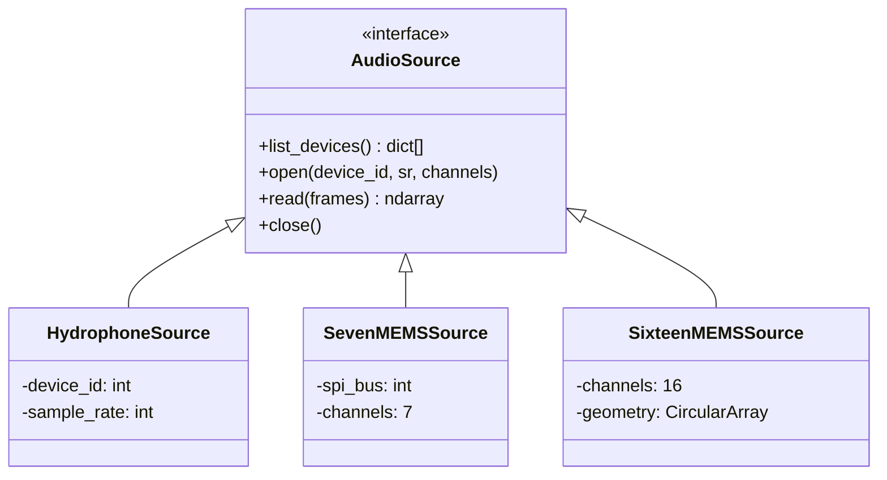

# Acoustic AI — System Architecture

## 1. System Overview

The Acoustic AI platform is a desktop application for environmental sound classification,
direction-of-arrival (DOA) estimation, Doppler velocity analysis, and frequency-band
pre-classification.  It combines an **Electron + Vite + React** frontend with a
**Python FastAPI** backend that hosts the ML pipeline.



### Deployment Modes

| Mode | Target | Includes | Excludes |
|------|--------|----------|----------|
| **Development** | Workstation | Full pipeline: acquisition, augmentation, training, inference, admin | — |
| **Edge** | Embedded / field device | Inference, DOA/Doppler, calibration, config | Training, data prep, augmentation |

---

## 2. Module Map

```
acoustic_ai/
├── flow-pilot-web-ui/               # Electron + React frontend
│   ├── electron/
│   │   ├── main.ts                   # Electron main process, SQLite, IPC
│   │   ├── preload.ts                # Context bridge
│   │   └── installer-config.ts       # Edge vs Development mode [NEW]
│   ├── src/
│   │   ├── components/
│   │   │   ├── experiment/           # Pipeline UI components
│   │   │   │   ├── ExperimentBuilder.tsx
│   │   │   │   ├── ExecutionParameters.tsx
│   │   │   │   ├── ExecutionEngine.tsx
│   │   │   │   ├── DataViewer.tsx
│   │   │   │   ├── LiveMonitor.tsx
│   │   │   │   ├── AIModuleConfig.tsx
│   │   │   │   ├── ParameterEditor.tsx
│   │   │   │   ├── DopplerAnalysis.tsx      # [NEW] Doppler/frequency viz
│   │   │   │   └── ManualFilter.tsx         # [NEW] Spectrogram keep/delete
│   │   │   ├── AdminPanel.tsx               # [NEW] Backend control
│   │   │   └── AppSidebar.tsx               # Conditional tabs by mode
│   │   ├── services/                 # API client layer
│   │   │   ├── dataAcquisitionService.ts
│   │   │   ├── mlProcessingService.ts
│   │   │   ├── preprocessingService.ts
│   │   │   ├── augmentationService.ts          # [NEW] M3 augmentation
│   │   │   ├── applicationService.ts           # [NEW] M5 classify/anomaly/cluster
│   │   │   ├── experimentService.ts
│   │   │   └── configurationService.ts
│   │   └── pages/
│   │       └── Index.tsx
│   └── tests/e2e/                    # [NEW] Playwright specs
│
├── sound_classifier_system/          # Python backend
│   ├── api/
│   │   ├── main.py                   # FastAPI entrypoint (uvicorn)
│   │   └── endpoints.py             # All REST + WebSocket routes
│   ├── acquisitions/
│   │   ├── hal/                      # Hardware Abstraction Layer
│   │   │   ├── hydrophone.py
│   │   │   ├── seven_mems.py
│   │   │   └── sixteen_mems.py
│   │   ├── dataset_download/
│   │   └── youtube/
│   ├── M2_processing/
│   │   ├── dataset_preparation/
│   │   │   ├── feature_extraction.py
│   │   │   ├── metadata_based_class_creation.py
│   │   │   ├── rename_class.py
│   │   │   └── organize_sound_samples.py
│   │   ├── augmentation/
│   │   │   ├── filtering_augmentation.py    # Quality gate + augmentation
│   │   │   ├── adjust_pitch.py
│   │   │   ├── adjust_volume.py
│   │   │   └── reverse_audio.py
│   │   ├── segmentation/
│   │   ├── frequency_filter.py              # Hybrid pre-classifier
│   │   └── doa.py                           # GCC-PHAT
│   ├── doppler/
│   │   └── doppler.py                       # FFT-based Doppler
│   ├── M3_modelling/
│   │   ├── model_manager.py
│   │   └── application_models.py            # [NEW] Anomaly + Clustering + Scene
│   ├── cleanup/
│   └── reports/
│
├── activate.sh                       # [NEW] venv alias
└── setup.sh                          # Directory scaffolding
```

---

## 3. Data Flow



---

## 4. API Endpoint Inventory

All endpoints are served under `/api/` prefix on `localhost:8000`.

### Health & Info
| Method | Path | Purpose |
|--------|------|---------|
| GET | `/health` | Liveness check |
| GET | `/status` | Module availability, version, uptime |

### Hardware Discovery
| Method | Path | Purpose |
|--------|------|---------|
| GET | `/hardware/devices` | List PortAudio input devices |

### Feature Extraction & Processing
| Method | Path | Purpose |
|--------|------|---------|
| POST | `/processing/extract-features` | Extract feature vector from audio file |
| POST | `/processing/source-separation` | NMF source separation → N sources |

### Analysis
| Method | Path | Purpose |
|--------|------|---------|
| POST | `/analysis/doa` | Direction of Arrival (GCC-PHAT) |
| POST | `/analysis/doppler` | Full Doppler velocity analysis |
| POST | `/analysis/frequency-bands` | Normalised energy per frequency band |
| POST | `/analysis/hybrid-classify` | Frequency bands + Doppler first-guess |

### Data Pipeline
| Method | Path | Purpose |
|--------|------|---------|
| POST | `/data/homogenise` | Metadata-based class creation |
| POST | `/data/filter-augment` | Two-stage filter + augment pipeline |
| POST | `/data/list-chunks` | List chunked audio files (for manual filter) |
| POST | `/data/keep-chunk` | Keep a chunk (move to filtered/) |
| POST | `/data/delete-chunk` | Delete a chunk |
| POST | `/data/chunk-audio` | Split audio on click/silence boundaries |
| POST | `/data/sliding-window` | Overlapping window segmentation |
| POST | `/data/noise-reduction` | Batch noise reduction |
| POST | `/data/quality-filter` | Quality filtering (SNR/RMS/duration) |
| POST | `/data/organize-splits` | Train/val/test dataset splitting |
| POST | `/data/rename-class` | Directory → class name mapping |
| POST | `/data/list-audio-dirs` | List directories with audio files |

### M3 Augmentation
| Method | Path | Purpose |
|--------|------|---------|
| POST | `/m3-augmentation/pitch-shift` | Batch pitch shifting |
| POST | `/m3-augmentation/volume-adjustment` | Batch volume scaling |
| POST | `/m3-augmentation/reverse` | Batch audio reversal |
| POST | `/m3-augmentation/noise-injection` | Batch noise injection |
| POST | `/m3-augmentation/time-stretch` | Batch time stretching |
| POST | `/m3-augmentation/pipeline` | Unified class-balanced augmentation |

### Visualisation
| Method | Path | Purpose |
|--------|------|---------|
| POST | `/visualize/spectrogram` | Mel spectrogram → Base64 PNG |
| POST | `/visualize/waveform` | Waveform plot → Base64 PNG |
| POST | `/visualize/doppler` | 3-panel Doppler plot → Base64 PNG |

### Model
| Method | Path | Purpose |
|--------|------|---------|
| POST | `/model/train` | Train classifier from features |
| POST | `/classify-audio/` | Classify single audio file |

### M5 Application
| Method | Path | Purpose |
|--------|------|---------|
| POST | `/m5-application/classify` | Application-level audio classification |
| POST | `/m5-application/anomaly-detection` | IsolationForest / OneClassSVM anomaly detection |
| POST | `/m5-application/clustering` | KMeans / DBSCAN / Hierarchical clustering |
| POST | `/m5-application/scene-analysis` | Combined frequency + anomaly + event |

### Real-time
| Method | Path | Purpose |
|--------|------|---------|
| WS | `/ws/stream/{sensor_id}` | Audio stream → features → classification |

---

## 5. Hardware Abstraction Layer (HAL)



---

## 6. Edge vs Development Mode

| Feature | Development | Edge |
|---------|:-----------:|:----:|
| Dataset download | ✅ | ❌ |
| Data homogenisation | ✅ | ❌ |
| Filtering & augmentation | ✅ | ❌ |
| Model training | ✅ | ❌ |
| Manual audio filtering | ✅ | ❌ |
| Reports | ✅ | ❌ |
| Real-time inference | ✅ | ✅ |
| DOA estimation | ✅ | ✅ |
| Doppler analysis | ✅ | ✅ |
| Hybrid classification | ✅ | ✅ |
| Calibration | ✅ | ✅ |
| Configuration | ✅ | ✅ |
| Admin panel | ✅ | ✅ |
