# Acoustic AI — Sequence Diagrams

Mermaid sequence diagrams showing how each backend service is triggered from the frontend.

---

## 1. Audio Acquisition (Hardware → WebSocket → Frontend)

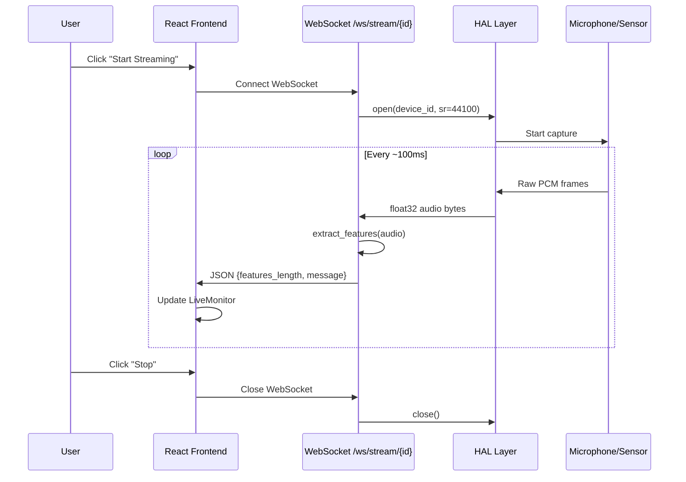

---

## 2. Feature Extraction (File Upload → API → Response)

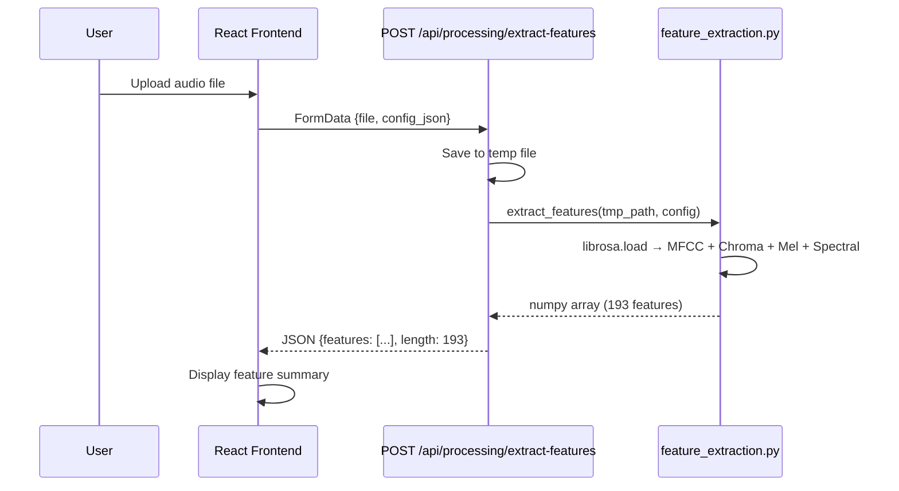

---

## 3. DOA Analysis (Multi-Channel Upload → GCC-PHAT → Angle)

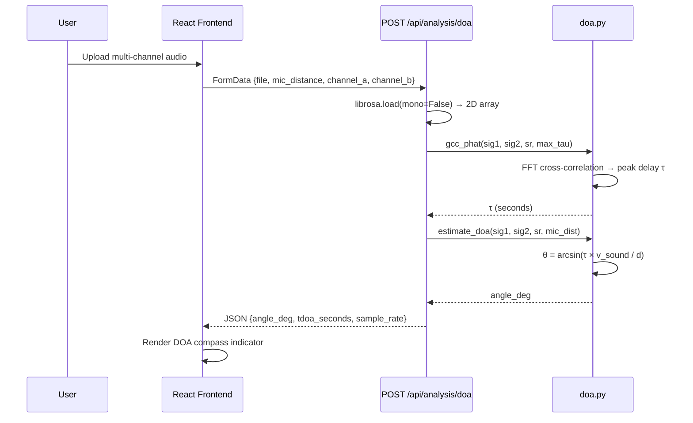

---

## 4. Doppler Analysis (Upload → FFT Frequency Track → Velocity)

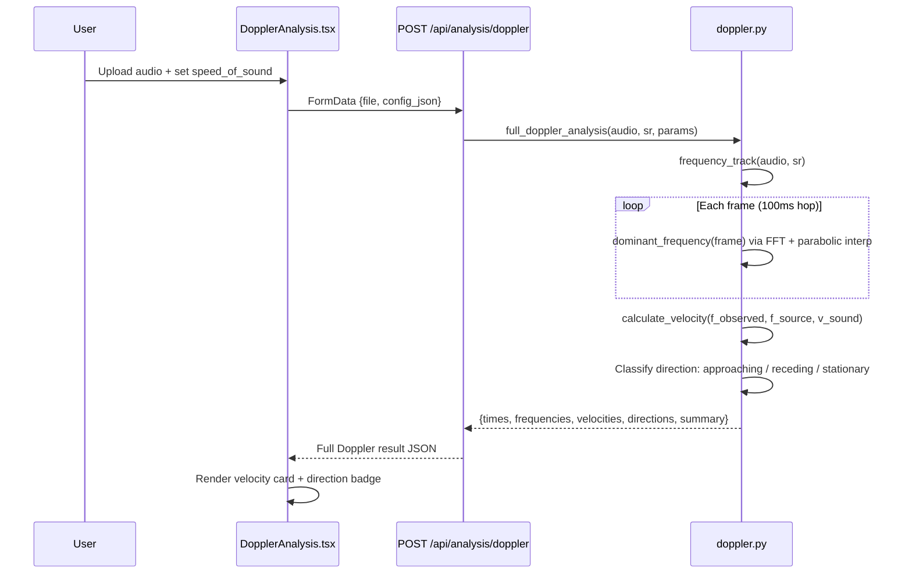

---

## 5. Hybrid Classification (Frequency Bands + Doppler → First Guess)

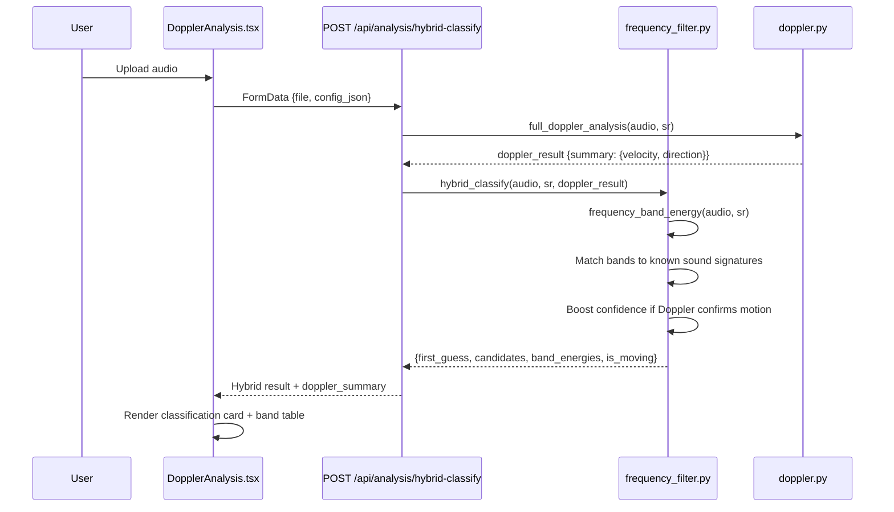

---

## 6. Data Homogenisation (Frontend Trigger → File Copy Pipeline)

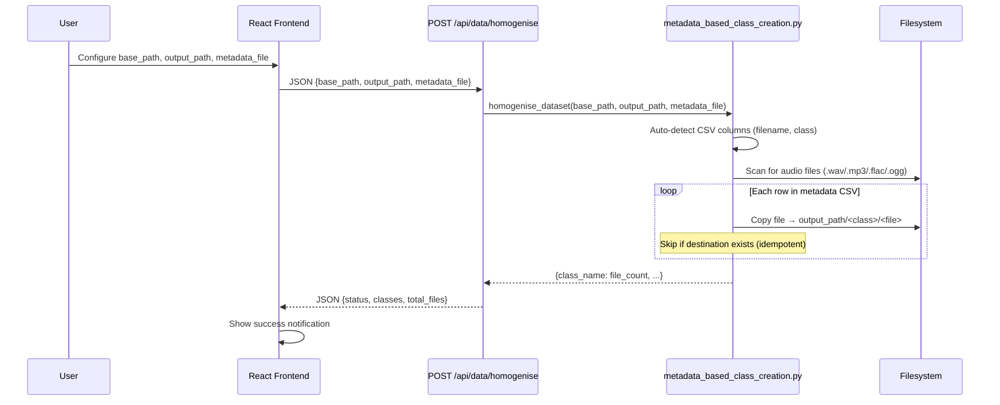

---

## 7. Filter + Augment Pipeline

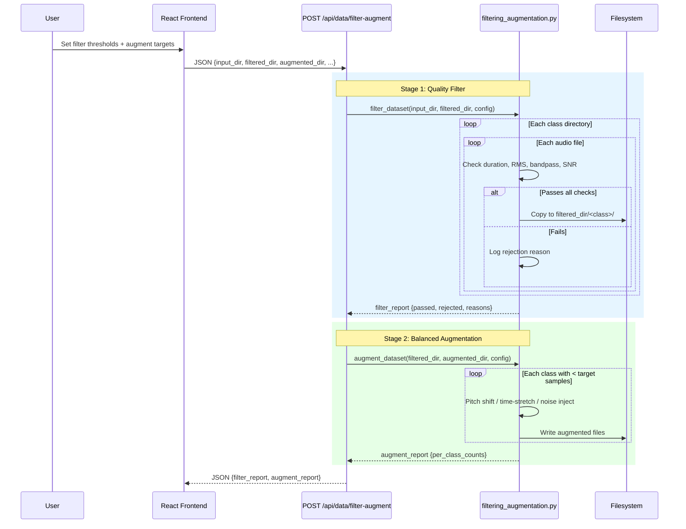

---

## 8. Model Training (Feature Folder → sklearn → Model Artifact)

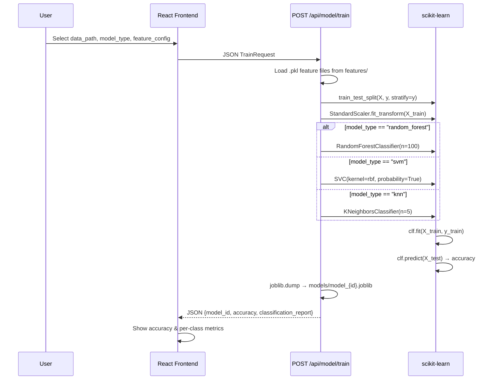

---

## 9. Real-time Classification (WebSocket Stream)

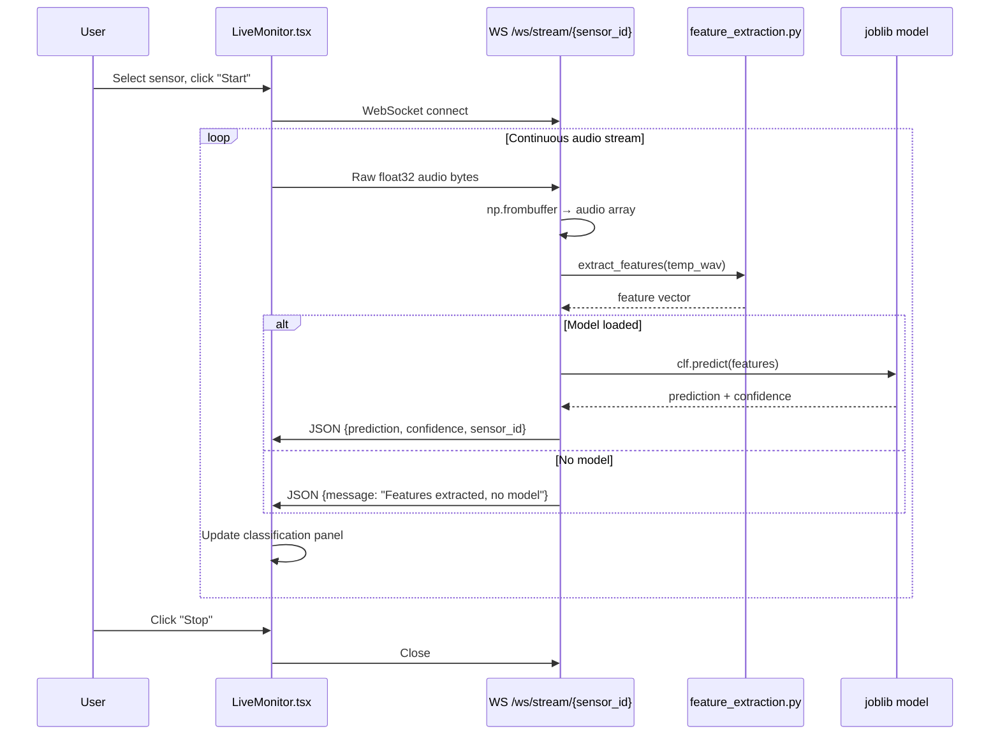

---

## 10. Spectrogram / Waveform Visualisation

```mermaid
sequenceDiagram
    participant U as User
    participant FE as React Frontend
    participant API as POST /api/visualize/spectrogram
    participant MPL as matplotlib

    U->>FE: Upload audio file
    FE->>API: FormData {file, n_fft=2048, hop_length=512}
    API->>API: librosa.load(tmp_path)
    API->>MPL: melspectrogram → power_to_db
    MPL->>MPL: specshow + colorbar
    MPL->>MPL: fig.savefig(buf, format=png, dpi=100)
    MPL-->>API: BytesIO PNG buffer
    API->>API: base64.b64encode(buf)
    API-->>FE: JSON {image_base64, content_type: "image/png"}
    FE->>FE: 
```

---

## 11. Doppler Visualisation Plot

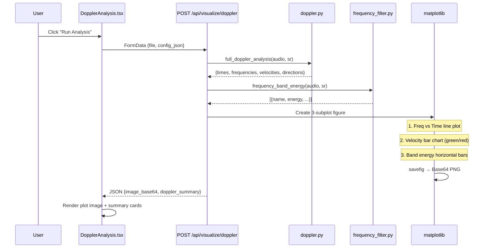

---

## 12. Anomaly Detection (Ambient vs Threat)

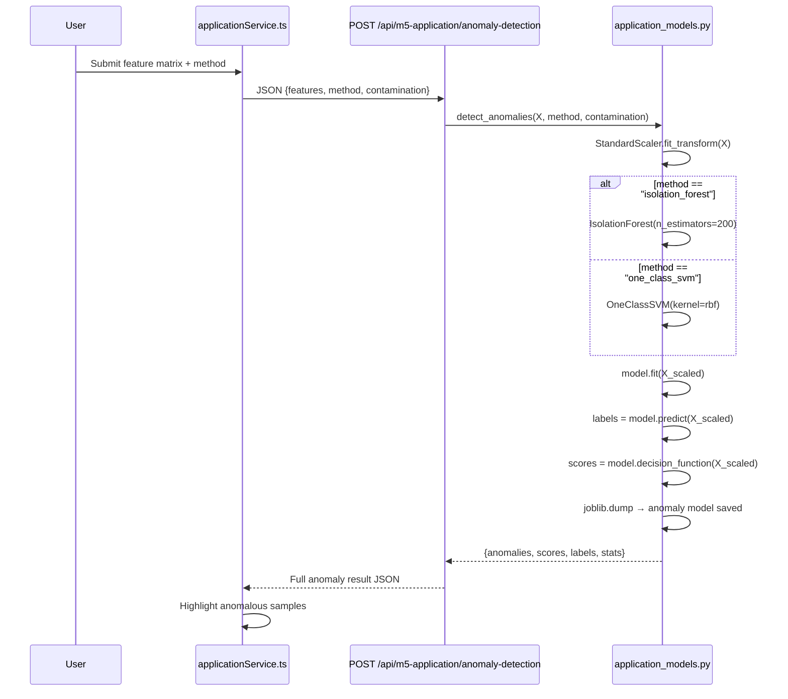

---

## 13. Audio Clustering (Unsupervised Labelling)

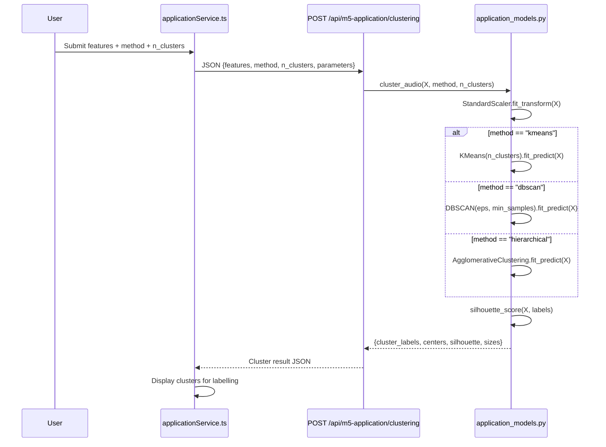

---

## 14. Audio Chunking (Click/Silence Split)

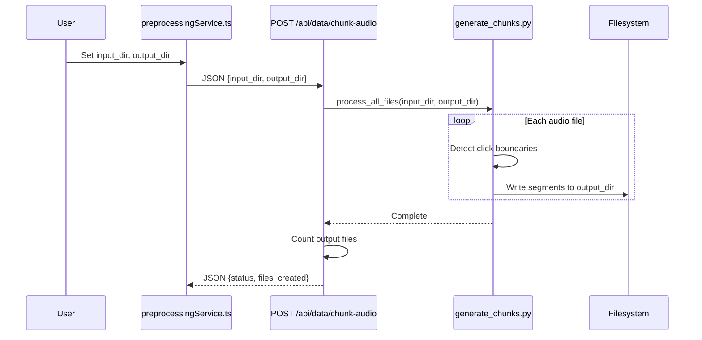

---

## 15. Dataset Split (Train/Val/Test)

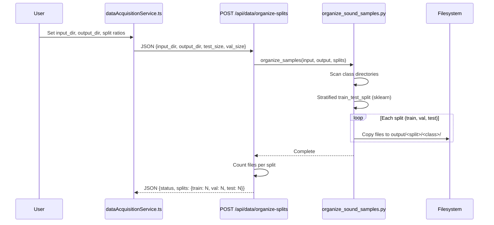

---

## 16. Source Separation (NMF)

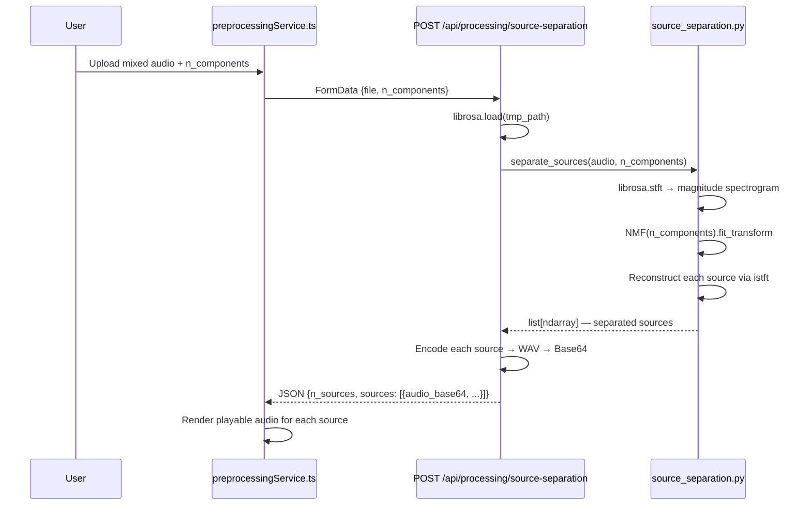

---

## 17. Admin Panel – Backend Process Management

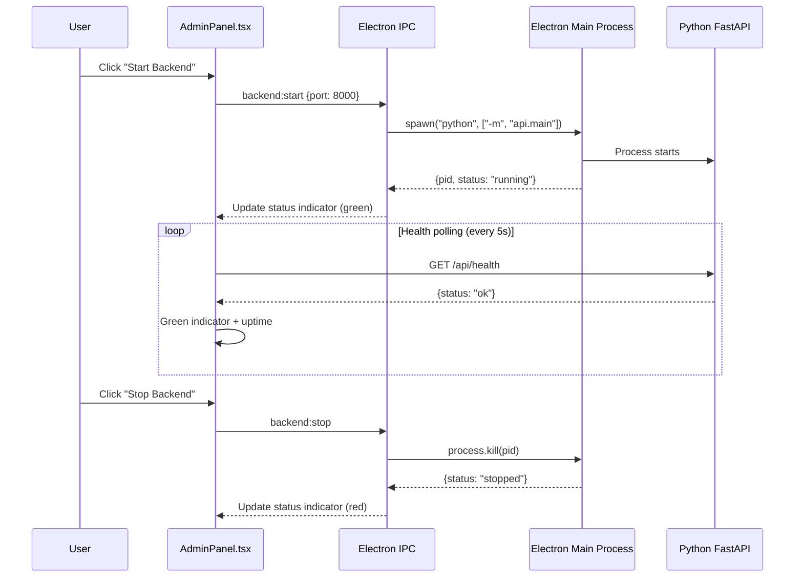
